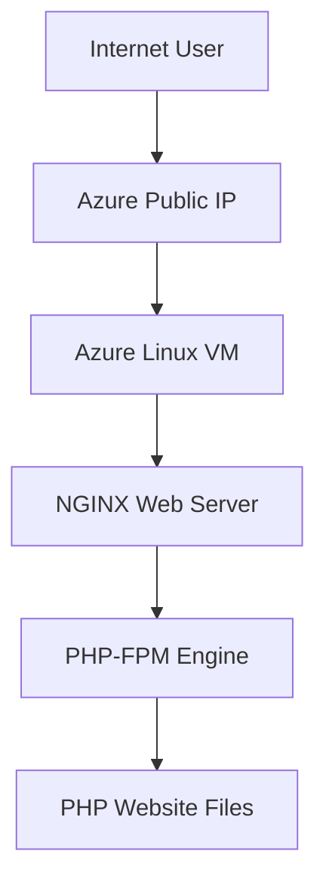

# 🌐 Enterprise Azure PHP Web Application Deployment Platform


Production-grade PHP web application deployment platform built on Microsoft Azure implementing Linux administration, NGINX web hosting, PHP-FPM processing and cloud infrastructure deployment practices.

---

# 📌 Executive Summary

Designed and implemented cloud-hosted PHP application deployment platform using:

✅ Azure Linux Virtual Machine

✅ Ubuntu Server Administration

✅ NGINX Web Server

✅ PHP-FPM Processing

✅ SSH Key Authentication

✅ Linux File Permission Management

✅ Production Web Hosting

✅ Troubleshooting & Debugging Workflow

---

# 🎯 Business Requirement

Modern application deployment environments require:

❌ Manual infrastructure dependency

❌ Improper web server configuration

❌ Dynamic content execution issues

❌ File permission problems

❌ Weak deployment validation

❌ Infrastructure troubleshooting limitations

This project solves those challenges using Azure cloud infrastructure and Linux web hosting practices.

---

# 🏗️ Architecture Design



---

# ⚙️ Core Components Implemented

### 🌐 Azure Linux VM

Capabilities:

✅ Ubuntu 24.04 Deployment

✅ Secure SSH Access

✅ Cloud Infrastructure Hosting

---

### 📦 NGINX Web Server

Capabilities:

✅ HTTP Request Handling

✅ Reverse Proxy Processing

✅ FastCGI Configuration

---

### ⚡ PHP-FPM Integration

Capabilities:

✅ Dynamic PHP Processing

✅ PHP Runtime Management

✅ FastCGI Performance Optimization

---

### 🔒 Secure Administration

Implemented:

✅ SSH Key Authentication

✅ Linux Permission Controls

✅ Production Deployment Access

---

# 🛠️ Prerequisites

Ensure environment readiness.

| Requirement | Details |
|-------------|----------|
| Azure Subscription | Active |
| Linux VM | Ubuntu 24.04 |
| SSH Client | Installed |
| NGINX | Installed |
| PHP-FPM | Installed |
| Git | Installed |

Verify services:

```bash
nginx -v
```

```bash
php -v
```

---

# ⚙️ Configuration Variables

Customize deployment configuration.

| Variable | Description | Default |
|-----------|-------------|----------|
| location | Azure Region | East US |
| vm_size | Virtual Machine SKU | Standard_B1s |
| web_root | Website Root Path | /var/www/html |
| php_version | PHP Runtime | 8.3 |
| ssh_user | VM Admin User | azureuser |

---

# ⚙️ Technology Stack

| Technology | Purpose |
|-------------|----------|
| Microsoft Azure | Cloud Platform |
| Ubuntu 24.04 | Linux Operating System |
| NGINX | Web Server |
| PHP-FPM | Dynamic Processing |
| SSH | Secure Administration |
| GitHub | Documentation |

---

# 📂 Project Structure

```bash

deployment/

├── commands.md

├── nginx.conf

└── README.md

```

---

# 🚀 Deployment Workflow

## 1️⃣ Azure VM Provisioning

Provisioned:

✅ Ubuntu Linux Virtual Machine

✅ Public IP

✅ Network Access

---

## 2️⃣ Secure SSH Connection

Connected securely:

```bash
ssh -i key.pem azureuser@PUBLIC-IP
```

---

## 3️⃣ NGINX Installation

Installed:

```bash
sudo apt update

sudo apt install nginx -y
```

---

## 4️⃣ PHP Installation

Installed:

```bash
sudo apt install php-fpm php-mysql -y
```

---

## 5️⃣ NGINX FastCGI Configuration

Configured:

✅ PHP Processing

✅ NGINX Integration

✅ Dynamic Content Rendering

---

## 6️⃣ Website Deployment

Uploaded files:

```bash
/var/www/html
```

Configured:

```bash
sudo chown -R www-data:www-data /var/www/html
```

---

## 7️⃣ Service Validation

Restarted:

```bash
sudo systemctl restart nginx

sudo systemctl restart php8.3-fpm
```

Validated:

✅ NGINX

✅ PHP-FPM

✅ Website Availability

---

# 🌍 Live Deployment

Application URL:

http://4.213.35.81

---

# ⚠️ Engineering Challenges Solved

| Challenge | Solution |
|------------|-----------|
| 403 Forbidden | Fixed file permissions |
| 502 Bad Gateway | Fixed PHP-FPM integration |
| Website inaccessible | NGINX validation |
| Permission issue | www-data ownership |

---

# 📈 Production Troubleshooting

Validated:

✅ NGINX Logs

✅ PHP Runtime

✅ Linux Permissions

✅ Service Health

✅ HTTP Response Validation

---

# 🧠 Skills Demonstrated

Azure Cloud

Linux Administration

Ubuntu Server

NGINX

PHP-FPM

SSH Administration

Cloud Deployment

Web Hosting

Production Troubleshooting

Infrastructure Operations

---

# 📈 Business Outcome

Successfully implemented production-grade PHP web deployment environment supporting:

✅ Cloud Hosting

✅ Dynamic Web Processing

✅ Linux Infrastructure

✅ Production Troubleshooting

✅ Secure Administration

---

# 👨‍💻 Author

## Amit Kumar

Cloud Engineer | Azure Administrator | DevOps Engineer

GitHub

https://github.com/Akamitt009

LinkedIn

https://www.linkedin.com/in/amit-kumar-657255232/
