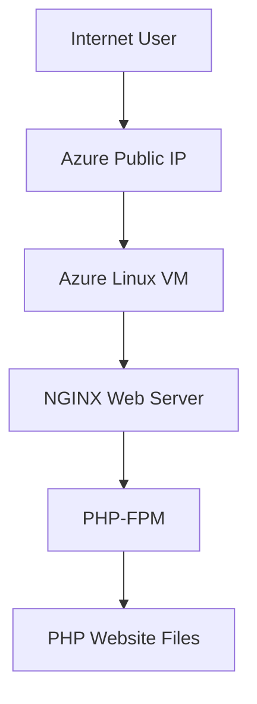

# 🌐 Enterprise Azure PHP Web Application Deployment Platform


Production-grade PHP web application deployment platform built on Microsoft Azure implementing Linux administration, NGINX web hosting, PHP-FPM processing and cloud infrastructure deployment practices.

---

# 📌 Executive Summary

Designed and implemented cloud-hosted PHP deployment platform using:

✅ Azure Linux Virtual Machine

✅ Ubuntu Server Administration

✅ NGINX Web Hosting

✅ PHP-FPM Runtime Integration

✅ SSH Secure Access

✅ Linux Permission Management

✅ Production Troubleshooting

✅ Real Cloud Deployment Validation

---

# 🎯 Business Requirement

Modern web hosting infrastructure requires:

❌ Manual deployment dependency

❌ Weak web server configuration

❌ Dynamic application processing issues

❌ Linux permission problems

❌ Service availability troubleshooting

❌ Production validation gaps

This project solves those challenges using Azure cloud infrastructure and Linux web hosting practices.

---

# 🏗️ Architecture Design



---

# ⚙️ Core Components Implemented

### 🌐 Azure Linux VM

Implemented:

✅ Ubuntu 24.04 Deployment

✅ Public IP Assignment

✅ Secure Remote Administration

---

### 📦 NGINX Web Server

Implemented:

✅ HTTP Request Processing

✅ Dynamic Content Delivery

✅ FastCGI Integration

---

### ⚡ PHP Runtime Processing

Configured:

✅ PHP-FPM

✅ PHP MySQL Extension

✅ FastCGI Execution

---

### 🔒 Secure Administration

Implemented:

✅ SSH Key Authentication

✅ Linux Permission Controls

✅ Production Access Management

---

# 🛠️ Prerequisites

Ensure environment readiness.

| Requirement | Details |
|-------------|----------|
| Azure Subscription | Active |
| Ubuntu Linux VM | Provisioned |
| SSH Client | Installed |
| NGINX | Installed |
| PHP-FPM | Installed |
| Git | Installed |

Verify:

```bash
nginx -v
```

Verify PHP:

```bash
php -v
```

---

# ⚙️ Configuration Variables

Customize deployment.

| Variable | Description | Default |
|---|---|---|
| location | Azure Region | East US |
| vm_size | Azure VM SKU | Standard_B1s |
| php_version | Runtime | 8.3 |
| web_root | Deployment Path | /var/www/html |
| ssh_user | Linux Admin User | azureuser |

---

# ⚙️ Technology Stack

| Technology | Purpose |
|---|---|
| Microsoft Azure | Cloud Platform |
| Ubuntu 24.04 | Linux Operating System |
| NGINX | Web Hosting |
| PHP-FPM | Runtime Processing |
| SSH | Secure Administration |
| GitHub | Documentation |

---

# 📂 Project Structure

```bash

deployment/

├── commands.md

├── nginx.conf

└── README.md

```

---

# 🚀 Deployment Workflow

## 1️⃣ Provision Azure VM

Created:

✅ Ubuntu Linux Virtual Machine

✅ Public IP

✅ Network Access

---

## 2️⃣ SSH Secure Access

Connected securely:

```bash
ssh -i key.pem azureuser@PUBLIC-IP
```

---

## 3️⃣ Install NGINX

```bash
sudo apt update

sudo apt install nginx -y
```

---

## 4️⃣ Install PHP

```bash
sudo apt install php-fpm php-mysql -y
```

---

## 5️⃣ Configure NGINX FastCGI

Configured:

✅ PHP Processing

✅ FastCGI Integration

✅ Dynamic Content Rendering

---

## 6️⃣ Upload Website Files

Deployment Path:

```bash
/var/www/html
```

Permission Configuration:

```bash
sudo chown -R www-data:www-data /var/www/html
```

---

## 7️⃣ Restart Services

```bash
sudo systemctl restart nginx

sudo systemctl restart php8.3-fpm
```

Validated:

✅ NGINX

✅ PHP-FPM

✅ Website Availability

---

# 🌍 Live Deployment

Live URL:

http://4.213.35.81

---

# 📸 Project Proof Screenshots

## Azure Linux VM Deployment


---

## SSH Connection Validation


---

## NGINX Installation


---

## PHP Installation


---

## PHP Runtime Validation


---

## NGINX Configuration


---

## Website Deployment


---

## Live Website Validation


---

# ⚠️ Engineering Challenges Solved

| Challenge | Solution |
|---|---|
| 403 Forbidden | Linux Permission Fix |
| 502 Bad Gateway | PHP-FPM Integration Validation |
| Website unavailable | NGINX Configuration Validation |
| Permission issue | www-data Ownership Fix |

---

# 📈 Production Troubleshooting

Validated:

✅ NGINX Logs

✅ PHP Runtime

✅ Linux Permissions

✅ HTTP Response Validation

✅ Service Health

---

# 🧠 Skills Demonstrated

Azure Cloud

Linux Administration

Ubuntu Server

NGINX

PHP-FPM

SSH Administration

Cloud Deployment

Web Hosting

Production Troubleshooting

Infrastructure Operations

---

# 📈 Business Outcome

Successfully implemented production-grade PHP deployment platform supporting:

✅ Cloud Hosting

✅ Dynamic PHP Execution

✅ Linux Infrastructure Management

✅ Production Troubleshooting

✅ Secure Administration

---

# 👨‍💻 Author

## Amit Kumar

Cloud Engineer | Azure Administrator | DevOps Engineer

GitHub

https://github.com/Akamitt009

LinkedIn

https://www.linkedin.com/in/amit-kumar-657255232/
